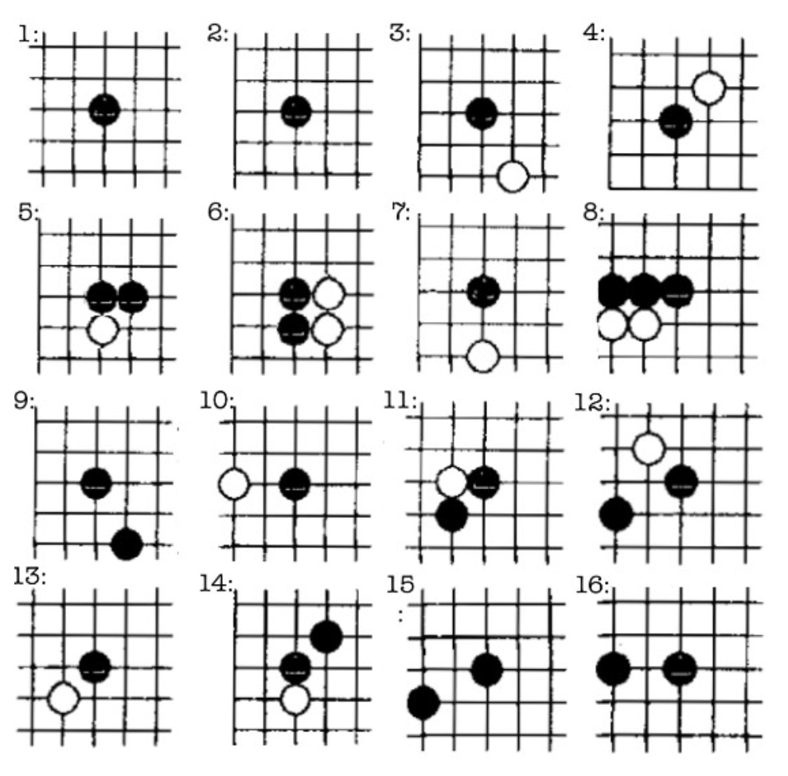
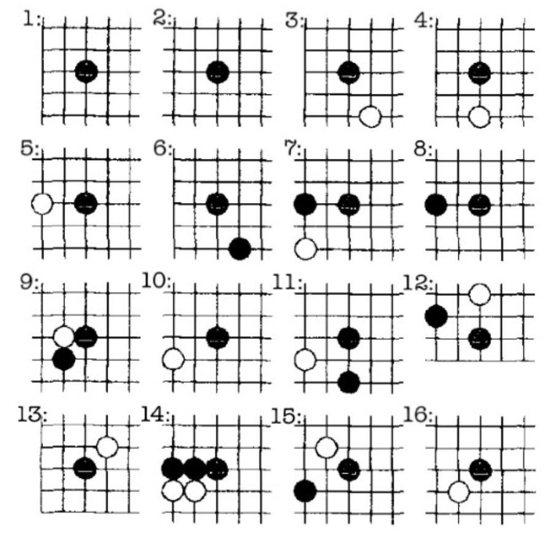

# Pattern Acquisition and Comparative Analysis in the Game of Go: A Modern Approach

**Author:** Ángel Alberto Sesma González
**Co-author:** Leonardo Jiménez Martínez
**Location:** Mineral del Chico, Hidalgo, Mexico
**Date:** March 14, 2025

---

## 1. Introduction

The game of Go poses a significant challenge for artificial intelligence due to its profound complexity, which has captivated scholars for centuries. While computer programs capable of playing Go have existed for decades, the last nine years (2016-2025) have marked a turning point, with systems achieving - and even surpassing - professional human performance. A notable shift in gameplay strategy emerged around 2016, driven by the adoption of unconventional yet effective moves demonstrated by AI programs, fundamentally altering traditional approaches.

To investigate this evolution, we conducted a comparative study:
We developed a Python program to analyze approximately 3,000 professional games from the past five years, extending the foundational work of Liu and Dou (2007) titled "Automatic Pattern Acquisition from Game Records in Go" (published in The Journal of China Universities of Posts and Telecommunications). Their pioneering study statistically cataloged patterns in 9,500 professional games from the early 2000s, laying the groundwork for modern pattern-based approaches in computational Go. However, the professional Go landscape has evolved significantly since then, with new strategies and gameplay styles emerging.

### Our contributions are threefold:

- We present an efficient algorithm for automatic pattern acquisition, building on the work of [1].
- We analyze high-frequency patterns in over 3,000 recent professional games, comparing them with 2007 results to identify evolutionary trends.
- We provide a quantitative comparative analysis of historical and contemporary popular patterns, revealing shifts in Go strategies.

## 2. Related Work

Pattern acquisition and analysis in Go have been extensively studied. Early efforts focused on manual pattern compilation and linguistic approaches to name specific moves in relation to their immediate surroundings and resulting shapes (e.g., keima, hane, tsuke, shimari, kikashi, nobi, ikken-tobi). In [1], a statistical method for automatic pattern acquisition was introduced, defining patterns as spatial relationships within a fixed $5 \times 5$ grid. This work demonstrated the feasibility of extracting high-quality patterns from game records and emphasized the importance of statistical usage to determine pattern urgency.

Recent advances in AI, particularly deep reinforcement learning, have shifted focus toward systems like AlphaGo, KataGo, or LeelaZero. Nevertheless, pattern-based approaches remain relevant for understanding human play and for developing AI systems. Studies since the 1990s have explored Monte Carlo tree search for move generation [2], terminology for board situations (e.g., liberties, captures, ko fights, and living groups) [3, 4], combinatorial methods to resolve complex endgame positions [5], and cataloged complexity levels for Go rule sets and variants [6].

Despite these advances, there is a lack of comparative studies analyzing the evolution of Go patterns over time. This article addresses that gap by applying the methodology of [1] to a modern dataset of professional games.

## 3. Methodology

### 3.1 Pattern Definition

A Go pattern is defined as a spatial configuration of stones within a $5 \times 5$ grid centered on a given move [1]. Our primary goal was to build a $5 \times 5$ pattern database, systematically extracted from every move in each game, and quantify their frequencies. To ensure accuracy, we implemented a canonical representation function that groups equivalent patterns by accounting for rotations, reflections, and color inversions. This method eliminates redundancies, enabling precise statistical comparisons across eras.

Additionally, we implemented a function to distinguish patterns on the board's outer three lines from those farther from the edges. This is critical for urgent patterns, which often relate to opening moves and strategies.

### 3.2 Dataset

We collected 3,147 recent professional games from online repositories (e.g., [http://go4go.net](http://go4go.net)). The records were automatically downloaded using a program designed by Dr. Mario Alberto Mercado for Hamiltonian energy calculations and shared with the lead author as part of a collaborative project.

### 3.3 Pattern Acquisition Algorithm

Based on the pseudocode from [1], we implemented the algorithm in Python 3. In this version, only the top 16 most frequent patterns are extracted to simplify comparative analysis:

```python
For each game:
    For each move:
        Extract the 5×5 grid centered on the move.
        Convert the grid to its canonical form.
        Update the pattern's frequency in the database.
Sort the database in descending order.
Print the top 16 patterns with their frequency.
```

(The algorithm has linear complexity relative to the number of moves, making it efficient for large datasets [1].)


### 3.4 Statistical Analysis

We analyzed the frequency distribution of patterns and identified the 16 most frequent ones. Based on these results, we detected potential stylistic changes in professional play over 18 years.

## 4. Results

### 4.1 High-Frequency Patterns

- The san-san invasion (3-3 point) rose from 13th to 4th in frequency.
- The shimari (corner enclosure) dropped from 6th to 9th.
- The hane against an isolated stone declined from 9th to 11th.



*Figure 1: Top 16 patterns in professional games (Sesma and Jiménez, 2025).*



*Figure 2: Top 16 patterns in professional games (Liu and Dou, 2007).*

### 4.2 Evolution of Strategies

The 3-3 invasion, once considered a late-game tactic, has gained urgency, while classical shimari has lost prominence, reflecting a trend toward aggressive, proactive play.

The 4-4 opening point, historically secondary, now dominates over 3-4, showing modern preferences for flexible, balanced openings.

## 5. Discussion

While $5 \times 5$ regional analysis does not capture global dynamics, it reveals low-frequency patterns that serve as continuations of high-frequency ones. By comparing a pattern's prevalence to its local continuations, we infer the relative frequency of moves outside the $5 \times 5$ area - a phenomenon consistent with tennuki (prioritizing a distant move over a local continuation). For example, if a pattern exceeds the frequency of its immediate continuation, players likely prioritize global strategies over local battles.

Advances in computational power enable expanding this methodology to larger regions (e.g., $7 \times 7$ or $9 \times 9$), offering richer insights into strategic evolution. Periodic replication of this study could deepen understanding of professional play, revitalize traditional proverbs, and modernize pedagogical frameworks.

## 6. Conclusion

This paper presents a modern approach to automatic pattern acquisition in Go, building on the foundational work of [1]. By analyzing an extensive dataset of recent professional games, we identify key trends in pattern usage, offering new perspectives on strategic evolution. Our results underscore the relevance of pattern-based approaches in both human and AI play and provide a framework for future research in game AI and pattern recognition.

## 7. Acknowledgments

We thank the virtual assistant Deepseek for its multidisciplinary capabilities and for refining this work for English presentation.

We thank Mario Alberto Mercado and Siddartha Ávila for their support during this study.

Last but not least, we dedicate this work to the memory of Professor José "Pepe Chac" Chacón, for his exemplary fighting spirit and invaluable contributions to Mexico's Go community.

## 8. References

1. Liu, Z., & Dou, Q. (2007). Automatic pattern acquisition from game records in Go. The Journal of China Universities of Posts and Telecommunications, 14(1), 100-106.
2. Bouzy, B., & Cazenave, T. (2001). Computer go: An AI oriented survey. Journal of Artificial Intelligence, 132(1), 39-103.
3. Yee, A., & Alvarado, M. (2015). Mathematical modeling and analysis of learning techniques for the game of Go. International Journal of Mathematical Models and Methods in Applied Sciences, 9(1), 293-302.
4. Spight, W. (2001). Extended thermography for multiple kos in Go. Theoretical Computer Science, 252(1), 23-43.
5. Berlekamp, E., & Wolfe, D. (1994). Mathematical Go: Chilling Gets the Last Point. A. K. Peters.
6. Saffidine, A., Teytaud, O., & Yen, S.-J. (2015). Go complexities. In Proceedings of the Advances in Computer Games Conference (pp. 8899). Springer.
